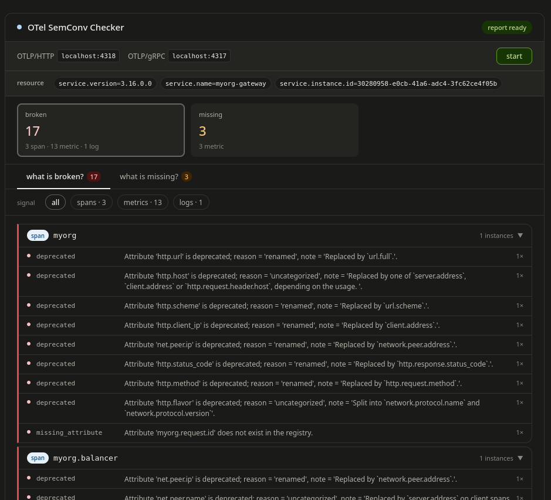
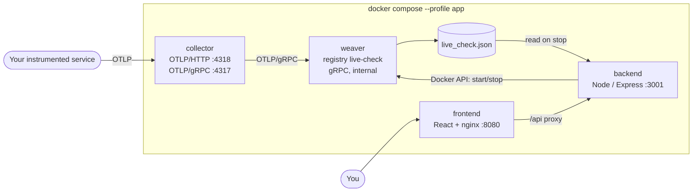

# OTel SemConv Checker

A self-hosted web app that turns [OpenTelemetry Weaver](https://github.com/open-telemetry/weaver)'s
`registry live-check` output into a conformance report a human can actually read.



## Why this exists

I built the first version of this at a previous employer to answer a basic
question we couldn't answer with any confidence: how conformant was our
OpenTelemetry output, right now, against spec? Weaver could already answer
that, but not in a form you could put in front of a stakeholder and talk
through. This project closes that gap, turning a conformance check into
something you can look at and discuss, not something you have to parse.

The tool itself isn't tied to any one product or gateway. It's a generic OTLP
sink, point any OTel-instrumented service's exporter at it and it works the
same way.

## What this is

OpenTelemetry's [semantic conventions](https://opentelemetry.io/docs/specs/semconv/)
are the shared vocabulary that makes telemetry portable: when every service names
an HTTP method `http.request.method` and a duration metric
`http.server.request.duration`, dashboards, alerts and analysis tools work across
services without per-service special-casing. When instrumentation drifts from the
spec, a deprecated attribute here, a string where an int was expected there, a
required attribute quietly omitted, that portability erodes silently, and you
usually find out in production.

**Weaver** is the OpenTelemetry project's tooling for working with semantic
conventions. `weaver registry live-check` opens an OTLP endpoint, watches the
telemetry your service actually emits, compares every signal against the
convention registry, and reports where you **break** the spec (deprecated
attributes, type mismatches, illegal namespaces) and where signals the spec
expects are **absent**. It is built to be automated, run it in a CI/CD pipeline,
gate a merge on it, script it.

The catch is its raw output is a large JSON document. This project keeps the
automation-friendly parts intact and adds the missing piece: a UI that reads that
document and shows, at a glance, **what your instrumentation is emitting that
breaks the spec, and what it's missing**, without anyone parsing JSON by hand.

## Install & run

**Requirements:** Docker and Docker Compose. (Node.js 20+ only if you want to run
the QA harness or regenerate the metric-requirements data.)

```sh
git clone https://github.com/sichvoge/otel-semconv-checker.git
cd otel-semconv-checker

# Weaver writes its report to the ./weaver-output bind mount as this user.
printf 'UID=%s\nGID=%s\n' "$(id -u)" "$(id -g)" > .env

docker compose --profile app up -d --build
```

First start takes ~1 minute: images build and Weaver resolves the semantic
convention registry before it opens its listener.

Once it's up:

| Service | URL |
|---|---|
| Web UI | http://localhost:8080 |
| OTLP/HTTP ingest | http://localhost:4318 |
| OTLP/gRPC ingest | http://localhost:4317 |
| Backend API | http://localhost:3001/api |

Then:

1. Open **http://localhost:8080**.
2. Point your instrumented service's OTLP exporter at the collector, e.g.
   `OTEL_EXPORTER_OTLP_ENDPOINT=http://localhost:4318`.
3. Press **start**. Weaver begins listening; the UI shows live span / metric
   datapoint / log counters and an elapsed timer.
4. Exercise your service so it emits telemetry through the exporter.
5. Press **stop**. Weaver flushes its report and the UI renders it:
   - **Resource banner** — the resource attributes every signal was tagged with.
   - **what is broken?** — emitted signals that carry findings: deprecated
     attributes, type mismatches, required attributes missing from metric data
     points. Grouped by signal, expandable, filterable by signal type.
   - **what is missing?** — registry signals the spec defines for the traffic it
     saw but that were never emitted, each with its expected attributes and
     requirement level.
   - **stat cards** — broken count, missing count.
6. Press **start** again for a fresh session (this clears the previous report).

Stop everything with `docker compose --profile app down` (add `-v` to also wipe
the Weaver output volume).

Running `docker compose up` **without** `--profile app` starts just the collector
and Weaver — useful if you only want to drive `live-check` yourself.

### Configuration

Two files shape what the report shows. They are read at container start, so
restart the affected service after editing.

- **`.weaver.toml`** — Weaver finding filters. Suppresses noisy finding types
  (`not_stable`, `missing_namespace`) and silences your proprietary namespaces at
  the source, before they reach the report.
- **`semconv-checker.config.yaml`** — application context Weaver can't know:
  which namespaces are proprietary, which metrics you expect to emit, which
  never-emitted metrics to ignore, known/documented violations, and the
  namespace scope for the "missing" tab.

The metric requirement levels used by the "missing" tab live in
`backend/src/data/metric-requirements.json` (committed). Regenerate them from the
upstream spec with:

```sh
cd backend && npm install && npm run fetch-metric-requirements
```

## Architecture



- **collector** (`otel/opentelemetry-collector`) — the single ingress. Accepts
  OTLP/HTTP and OTLP/gRPC from any service and forwards everything to Weaver over
  gRPC (Weaver is gRPC-only). Also exposes its own Prometheus metrics on an
  internal port so the backend can show live signal counts while a session runs.
- **weaver** (`otel/weaver`) — runs `registry live-check`. gRPC listener is
  internal only. It is started and stopped **per session** by the backend over
  the Docker API, and writes `live_check.json` to a shared volume when it stops.
- **backend** (Node.js + Express) — owns the session state machine
  (`idle → listening → report`), drives Weaver's lifecycle over the Docker
  socket, restarts the collector at the start of each session so its exporter
  reconnects cleanly, parses the Weaver report, derives the "missing" list from
  the config and metric-requirements data, and serves the REST API.
- **frontend** (React + Vite, served by nginx) — the three-state UI. nginx also
  reverse-proxies `/api` to the backend so the browser talks to one origin.

### Built by agents

This repository is also an experiment in getting a project to "done" with
**multiple AI agents and as little human input as possible**. The only
human-authored inputs were the initial requirements
([`references/SPEC.md`](references/SPEC.md)) and a static UI prototype
([`references/prototype-2026-04-15.html`](references/prototype-2026-04-15.html)).
Everything else — the implementation, the tests, the fixes — was produced by
agents working to a fixed loop.

- **`plans/`** — one plan file per phase (six phases, infrastructure → backend →
  three frontend phases → the metric-requirements script). These are the
  contract each phase is built and judged against.
- **`agents/BUILDER-AGENT.md`** — the builder. Reads the current phase plan,
  implements only that phase, hands off to QA, and on a failure reads the output,
  states a hypothesis, applies a targeted fix and retries (max three attempts per
  phase).
- **`agents/QA-AGENT.md`** — the QA agent. For each phase it writes a fully
  autonomous `qa/phase-XX/validate.js` that spins up the real Docker stack, runs
  a synthetic OTLP emitter (`qa/test-app/`), drives the UI with Playwright,
  checks the phase's assertions, and tears everything down. It never edits
  implementation code — it only reports pass/fail.
- **Execution model** ([`CLAUDE.md`](CLAUDE.md)) — for each phase: builder
  implements → QA validates against the plan's assertions → a green run advances
  to the next phase.

The `qa/phase-01..06/` folders and their assertion counts are the record of that
loop.

## License

MIT — see [`LICENSE`](LICENSE).
