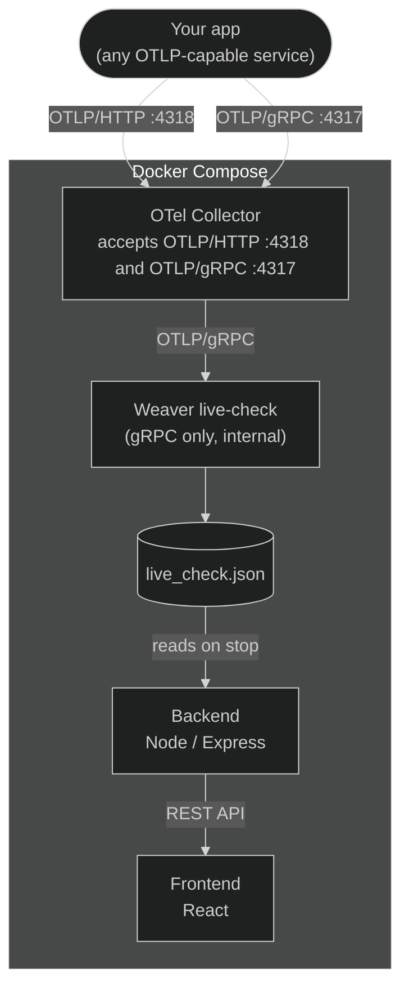

# OTel SemConv Checker — Spec

A web app that wraps `weaver registry live-check` to help teams understand how well
their OTLP instrumentation conforms to OpenTelemetry semantic conventions, and where
the gaps are.

---

## Goals

- Expose an OTLP endpoint (HTTP and gRPC) that any instrumented service can point at.
- Run a Weaver live-check session, collect telemetry, and produce a conformance report.
- Make it immediately clear where instrumentation *violates* the spec (broken) and
  where signals are *absent* (missing).
- Be configurable enough to suppress noise that is not relevant to a given service.

---

## Architecture



> Weaver only supports OTLP/gRPC. The OTel Collector accepts both OTLP/HTTP
> (port 4318) and OTLP/gRPC (port 4317) from any external app and forwards
> to Weaver's internal gRPC listener. Both ports are published externally.

### Components

| Component | Technology | Role |
|-----------|------------|------|
| `collector` | `otel/opentelemetry-collector` | Accepts OTLP/HTTP on port 4318 and OTLP/gRPC on port 4317. Forwards to Weaver via gRPC internally. |
| `weaver` | `otel/weaver` Docker image | Runs `registry live-check`. gRPC only. Started/stopped by backend via Docker API. Exposes `/stop` on port 4320. `restart: "no"`. Internal only. |
| `backend` | Node.js + Express | Manages Weaver lifecycle. Parses report. Exposes REST API. |
| `frontend` | React + Vite | Three-state UI: idle → listening → report. |

---

## Session lifecycle

Three states, two actions:

```
idle ──[start]──► listening ──[stop]──► report
                                           │
                                        [start]
                                           │
                                           ▼
                                        listening
```

### idle
Initial state on stack startup. No Weaver container running. Single green `start`
button visible.

### listening
Weaver is running and accumulating OTLP traffic. UI shows live counters (spans /
metrics / logs / elapsed time) and a single red `stop` button.

### report
User pressed stop. Weaver flushed the report and exited. UI displays the full
conformance report. Single green `start` button visible — pressing it starts a new
session and clears the previous report.

---

## Configuration

Two configuration files shape the tool's behaviour. They complement each other:
Weaver filters reduce noise in the raw report before it is written; semconv checker config
shapes what the UI considers meaningful after the report is read.

### `.weaver.toml`

Mounted into the Weaver container. Used to suppress noisy findings at source —
before they enter the report. Preferred over frontend filtering because it reduces
report size and keeps the raw JSON clean.

The key sections relevant to the semconv checker:

```toml
# The per-command config section key is `live-check` (hyphen). Weaver resolves
# it by that literal key — `[live_check]` (underscore) is silently ignored,
# which would leave the gRPC listener bound to loopback.
[live-check]
format = "json"

[live-check.otlp]
grpc_address = "0.0.0.0"
grpc_port = 4317
admin_port = 4320
inactivity_timeout = 0

# not_stable and missing_namespace are too noisy — suppress globally.
[[live-check.finding_filters]]
exclude = ["not_stable", "missing_namespace"]

# For custom-namespace signals only, drop the semconv namespace / missing-signal
# findings. `sample_names` scopes the filter: a finding is dropped only when its
# sample name matches AND its id is in `exclude`. Do NOT use `exclude_samples`
# here — Weaver ORs it with `exclude`, which would drop these ids for every
# signal, not just custom ones.
# Mirror the namespaces listed in semconv-checker.config.yaml custom_namespaces.
[[live-check.finding_filters]]
exclude = ["illegal_namespace", "extends_namespace", "missing_attribute", "missing_metric"]
sample_names = ["custom.*"]

# Belt-and-braces: drop every remaining finding on custom-namespace samples so
# proprietary signals are fully silenced regardless of finding id.
[[live-check.finding_filters]]
exclude_samples = ["custom.*"]
```

### `semconv-checker.config.yaml`

Mounted into the backend container. Handles application-specific context that Weaver
cannot know about.

```yaml
# Namespaces treated as proprietary — silenced from all tabs.
# Mirror these in .weaver.toml finding_filters (sample_names / exclude_samples).
# Default: []
custom_namespaces:
  - custom
  - myapp

# Metrics explicitly expected to be emitted.
# If never seen, they appear in the missing tab regardless of namespace detection
# or requirement level (an opt-in metric listed here is still surfaced).
# Default: []
expected_metrics:
  - http.server.active_requests

# Metrics intentionally not emitted — suppressed from the missing tab.
# Default: []
ignored_metrics:
  - http.client.request.body.size

# Known violations — findings that are expected and documented.
# A suppressed finding that Weaver stops reporting is flagged as stale,
# so suppressions don't outlive the gap that caused them.
# Default: []
expected_violations:
  - id: required_attribute_not_present
    context:
      attribute_name: http.request.method
    reason: >-
      This service does not record the request method on its duration metric yet.
      Tracked in https://github.com/org/repo/issues/123
  - id: deprecated
    context:
      attribute_name: http.method
    reason: >-
      Upstream SDK has not yet migrated to http.request.method.
      Will be resolved when SDK is updated to version 2.x.

# Semconv namespaces to evaluate for missing signals.
# Overrides automatic detection when set.
# Default: [] (auto-detect from seen attributes and metrics)
namespaces:
  - http
  - gen_ai
```

**Responsibility split:**

| Concern | Config file | Reason |
|---------|------------|--------|
| Suppress noisy finding types (e.g. `not_stable`) | `.weaver.toml` | Filter at source |
| Custom namespace suppression | both | Weaver drops findings; semconv checker config tells UI which namespaces are custom |
| Expected metrics | `semconv-checker.config.yaml` | Weaver has no concept of expected signals |
| Ignored metrics | `semconv-checker.config.yaml` | Application-specific context |
| Known/expected violations | `semconv-checker.config.yaml` | Suppress specific findings with a documented reason. Stale suppressions are flagged. |
| Namespace scope for missing tab | `semconv-checker.config.yaml` | Application-specific context |

---

## Backend API

Base path: `/api`

### `GET /api/session`

```json
{
  "status": "idle" | "listening" | "report" | "error",
  "started_at": "2026-04-14T10:00:00Z" | null,
  "stopped_at": "2026-04-14T10:02:00Z" | null,
  "otlp_grpc": "localhost:4317",
  "otlp_http": "localhost:4318",
  "signal_counts": { "spans": 0, "metrics": 0, "logs": 0 }
}
```

### `POST /api/session/start`

Starts a new session. Deletes any existing report. Returns 409 if already listening.

### `POST /api/session/stop`

Calls Weaver's `/stop` endpoint, flushes the report. Returns 400 if not listening.

### `GET /api/report`

Returns the parsed report. Returns 404 if no report available.

```json
{
  "entities": [ ...entity objects with live_check_result... ],
  "stats": { ...statistics object... }
}
```

### `GET /api/config`

Returns the active `semconv-checker.config.yaml` as JSON. Used by the frontend to determine
custom namespaces and expected metrics. Returns defaults if no config file is present.

```json
{
  "custom_namespaces": ["custom"],
  "expected_metrics": ["http.server.active_requests"],
  "ignored_metrics": ["http.client.request.body.size"],
  "namespaces": ["http", "gen_ai"],
  "expected_violations": [
    {
      "id": "required_attribute_not_present",
      "context": { "attribute_name": "http.request.method" },
      "reason": "This service does not record the request method on its duration metric yet."
    }
  ]
}
```

### `GET /api/health`

Returns 200 OK.

---

## Weaver report structure

The `--format=json` output is a JSON **object** (not a flat array) with two
top-level keys:

```json
{
  "samples": [ ...entity objects... ],
  "statistics": { ...stats object... }
}
```

### Entity objects

Each emitted signal is represented as a sample entity object augmented with a
`live_check_result` at the level where findings apply. Findings are embedded inside
the entity they describe — they are not top-level entries. A span with nested
attributes may have `live_check_result` at both the span level and the attribute
level. The frontend must walk the entity tree recursively.

```json
{
  "name": "http.method",
  "type": "string",
  "value": "GET",
  "live_check_result": {
    "all_advice": [
      {
        "level": "violation",
        "id": "deprecated",
        "message": "Attribute 'http.method' is deprecated. Replaced by 'http.request.method'.",
        "context": { "attribute_key": "http.method" },
        "signal_name": "my-service",
        "signal_type": "span"
      }
    ],
    "highest_advice_level": "violation"
  }
}
```

#### `PolicyFinding` fields

| Field | Type | Description |
|-------|------|-------------|
| `level` | string | `"violation"` \| `"improvement"` \| `"information"` |
| `id` | string | Machine-readable finding type (see finding IDs below) |
| `message` | string | Human-readable description |
| `context` | object | Structured key-value details |
| `signal_name` | string\|null | Name of the signal |
| `signal_type` | string\|null | `"span"` \| `"metric"` \| `"log"` \| `"resource"` |

### Statistics object

The report's `statistics` value, populated when the session closes.
Identified by the presence of `total_entities`.

Key fields:

| Field | Description |
|-------|-------------|
| `registry_coverage` | Fraction of semconv attributes seen (0.0–1.0) |
| `seen_registry_attributes` | Map of attribute name → count. Count = 0 means never emitted (gap). |
| `seen_non_registry_attributes` | Attributes emitted that are not in the registry |
| `seen_registry_metrics` | Map of metric name → count. Count = 0 means never emitted. |
| `seen_non_registry_metrics` | Metrics emitted that are not in the registry |
| `advice_type_counts` | Breakdown of findings by type |
| `total_entities_by_type` | Count of entities by type (`span`, `metric`, `log`, `attribute`, `resource`, `span_event`) |

---

## Weaver finding IDs (confirmed)

Confirmed from the Weaver README and real output. Any finding ID not in this list
is unexpected and should be logged for investigation.

| Finding ID | Level | Description |
|------------|-------|-------------|
| `missing_attribute` | violation | Attribute was emitted but does not exist in the registry. Weaver does NOT flag required-but-absent attributes with this id. |
| `missing_metric` | violation | Metric does not exist in the registry |
| `required_attribute_not_present` | violation | A registry-required attribute is absent. Only fires where Weaver resolves the signal to a registry group — i.e. **metric data points** and log records with a matching `event.name`. Never for spans. |
| `recommended_attribute_not_present` | improvement | As above, for a recommended attribute. |
| `conditionally_required_attribute_not_present` | information | As above, for a conditionally-required attribute. |
| `opt_in_attribute_not_present` | information | As above, for an opt-in attribute. |
| `illegal_namespace` | violation | Signal uses a namespace not permitted by the spec |
| `type_mismatch` | violation | Attribute value type does not match the registry definition |
| `invalid_format` | violation | Attribute name or value does not match expected format |
| `extends_namespace` | improvement | Signal extends a known namespace but is not in the registry |
| `missing_namespace` | improvement | Signal name has no valid namespace prefix |
| `deprecated` | violation | Attribute or signal has been deprecated in the registry |
| `not_stable` | improvement | Attribute or signal stability is `development`, not yet stable |

---

## Frontend

### Session states

The UI has three distinct visual states. The reference prototype is
`prototype-2026-04-15.html`.

**Idle** — status badge: "idle" (gray). Button: green `start`. Body: centered
instructions telling the user to point their OTLP exporter at the published endpoint
and press start.

**Listening** — status badge: "● listening" (amber, animated pulse dot). Button:
red `stop`. Body: centered panel with live counters (spans / metrics / logs /
elapsed time), updating every 2 seconds.

**Report** — status badge: "report ready" (green). Button: green `start` (starts
new session). Body: full report rendered below the session bar.

### Report layout

See `prototype-2026-04-15.html` for the exact visual layout. The report consists of:

- **Resource banner** — always shown at top. Displays resource attributes and their
  conformance status. Fixed, not filterable.
- **Stat cards** — broken count, missing count. Both are clickable and switch tabs.
- **Tab bar** — two tabs: "what is broken?" and "what is missing?".
- **Signal filter** — inside each tab. Always shows all three signal types (spans,
  metrics, logs) with counts. Zero-count pills are visible but non-interactive.
  Filter state is per-tab and independent.

### Tabs

#### what is broken?

Signal groups that were emitted but have semconv findings.

Shows all `violation` level findings (`type_mismatch`,
`required_attribute_not_present` on emitted metric data points, `illegal_namespace`
on non-custom signals, `deprecated`).

`not_stable` findings are suppressed by `.weaver.toml` and never reach the report.
Custom namespace findings are suppressed by the frontend transform.
Signals never emitted belong in the missing tab.

Cards with violations are expanded by default. Cards with only improvements are
collapsed.

#### what is missing?

Signal groups that semconv defines for the observed traffic pattern but that were
never emitted during the session.

Source: `seen_registry_metrics` and `seen_registry_attributes` with count = 0,
filtered to active namespaces. Also includes metrics listed in `expected_metrics`
in `semconv-checker.config.yaml`. Excludes metrics in `ignored_metrics`.

Each card shows the signal name, stability badge, and the expected attributes with
their requirement levels (required → red chip, recommended → amber chip).

### Custom namespace transform

Applied in the frontend after loading `GET /api/config`. Any attribute or metric
whose name starts with a prefix listed in `custom_namespaces` is silently suppressed
— not shown in any tab, not counted in any stat card. This applies to findings with
IDs: `missing_attribute`, `missing_metric`, `illegal_namespace`, `extends_namespace`.

### Design system

The frontend uses CSS custom properties exclusively for colours. No hardcode hex
values except for the three signal type badge colours (categorical, not semantic).

Signal type badge colours (hardcoded):
- span: `background #E6F1FB`, `color #0C447C`
- metric: `background #FAEEDA`, `color #633806`
- log: `background #EEEDFE`, `color #3C3489`

Finding level colours (semantic tokens):
- violation → `var(--color-background-danger)` / `var(--color-text-danger)`
- improvement → `var(--color-background-warning)` / `var(--color-text-warning)`
- information → `var(--color-background-secondary)` / `var(--color-text-secondary)`
- clean → `var(--color-background-success)` / `var(--color-text-success)`

Session button colours:
- start → success background + success text + success border
- stop → danger background + danger text + danger border

All styles live in `src/styles/index.css`. No inline styles in components.

---

## Scripts

### `fetch-metric-requirements.js`

Run on demand via `npm run fetch-metric-requirements`. Scrapes the official
OpenTelemetry semantic conventions GitHub repository to extract the requirement
level for every metric defined in the spec, and writes the result to
`src/data/metric-requirements.json`.

The backend reads this file at startup and uses it to label each never-emitted
metric in the missing tab with its requirement level, and to drop `opt_in`
metrics from that tab entirely (unless listed in `expected_metrics`). If a
metric is not in the file the backend falls back to `"recommended"`.
Note: as of the current registry, no metric is `"required"` — the level is in
practice `"recommended"` or `"opt_in"` — but the script still supports
`"required"` for forward compatibility.

**Output format:**
```json
{
  "generated_at": "2026-04-15T10:03:00Z",
  "semconv_version": "main",
  "source": "https://github.com/open-telemetry/semantic-conventions/tree/main/docs",
  "metrics": {
    "http.server.request.duration": "recommended",
    "http.client.request.duration": "recommended",
    "http.server.active_requests": "opt_in"
  }
}
```

**Requirement level values:** `"required"` | `"recommended"` | `"opt_in"`

**How it works:**
1. Fetches the GitHub tree API to discover all `*-metrics.md` files under `docs/`
2. Fetches each file from `raw.githubusercontent.com`
3. Parses the prose pattern in each section. Supported variants:
   - `This metric is required.` → `"required"`
   - `This metric is recommended.` → `"recommended"`
   - `This metric is opt-in.` → `"opt_in"`
   - `This metric is optional.` → `"opt_in"`
4. Writes `src/data/metric-requirements.json`
5. Prints a summary of pages fetched, metrics found, and any skipped

Metrics whose requirement level is `opt_in` are never shown in the missing tab.

---

## What is not implemented

### Weaver output discarded at parse time

These items are present in the Weaver report but deliberately not surfaced. Confirmed
from the Weaver README and/or real output.

| Item | Reason |
|------|--------|
| `not_stable` findings | Not actionable. Suppressed by `.weaver.toml`. Future: informational tab. |
| `information` level findings (non-custom) | e.g. `conditionally_required_attribute_not_present`, `opt_in_attribute_not_present`. Discarded if seen. |
| `span_event` entities | Present in `total_entities_by_type` but not evaluated. |
| Events signal type | `seen_registry_events` / `seen_non_registry_events` present in stats but not evaluated. |
| Clean entities (no findings) | Not surfaced anywhere in the UI. Registry coverage % was dropped as a stat card — as a raw seen/registry-total fraction it was ambiguous (low % is expected/normal, not a signal of a problem). |

Note: `missing_namespace` findings are suppressed upstream in `.weaver.toml` and
never reach the report. `opt_in` metric filtering is applied by the backend using
`metric-requirements.json` — it is not a Weaver concept.

### Deferred features

| Item | Notes |
|------|-------|
| Informational tab | For `not_stable` and other non-actionable findings. |
| Events and span_event evaluation | Signal types present in Weaver output but not yet handled. |
| Persistent report storage | Reports are lost on container restart. |
| Multiple concurrent sessions | One session at a time. |
| Authentication / access control | Intended for local / internal use. |
| Real-time streaming of findings | Session-based only — report produced on stop. |

---

## Reference files

- `prototype-2026-04-15.html` — interactive UI prototype. Visual source of truth
  for all frontend states, colours, and interactions.
- `.weaver.toml` — Weaver finding filters and OTLP listener config.
- `semconv-checker.config.yaml` — application-level conformance configuration.
- `src/data/metric-requirements.json` — generated by `fetch-metric-requirements.js`.
  Do not edit manually.
